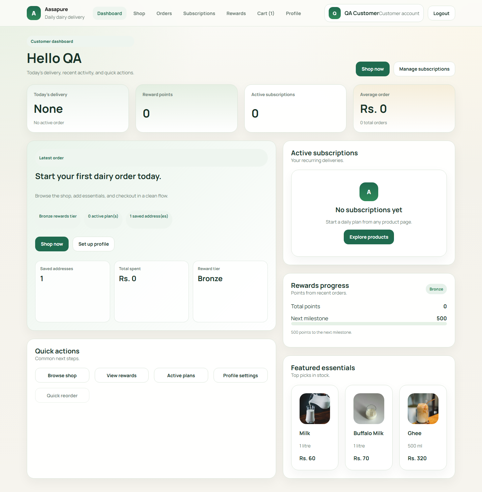
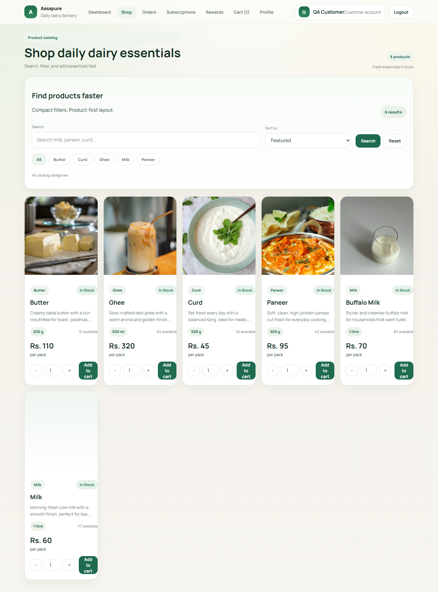
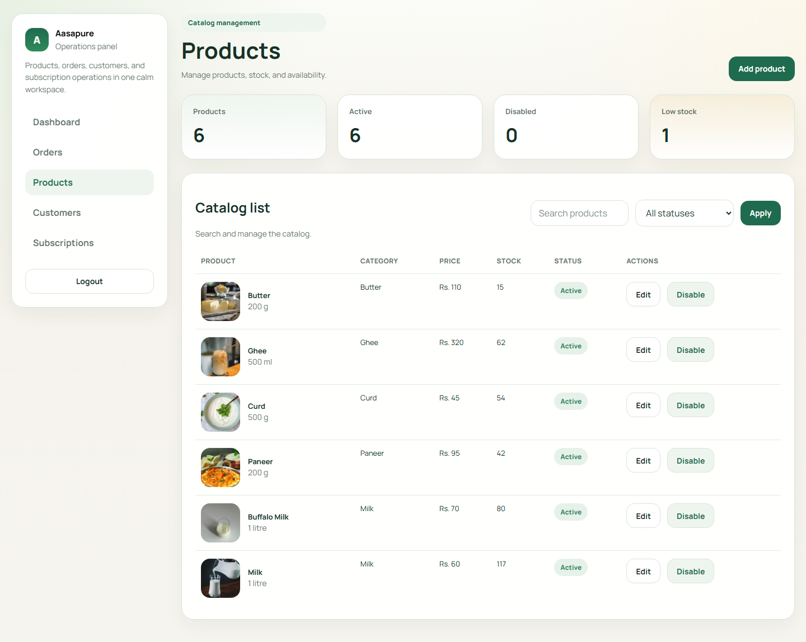

# Aasapure Customer Module

Aasapure is a production-style MERN dairy ecommerce project with separate customer and admin experiences. The customer app covers signup, login, shopping, checkout, orders, subscriptions, rewards, and profile management. The admin app focuses on products, orders, customers, subscriptions, and operational visibility.

## Project Overview

- Customer-facing dairy catalog with cart, checkout, orders, rewards, and subscriptions
- Admin panel for managing products, order status, customers, and recurring plans
- MongoDB-backed data with JWT authentication and seeded core catalog bootstrap
- Responsive UI tuned for mobile, tablet, laptop, and desktop

## Feature

### Customer

- Signup, login, logout, and session restore
- Dashboard with active delivery, rewards, subscriptions, and featured products
- Product catalog with search, category filters, sorting, and quick add to cart
- Product detail page with quantity controls and subscription action
- Cart, checkout, order placement, order history, and order tracking
- Rewards progress and redeem suggestions
- Profile updates for personal info, addresses, and preferences

### Admin

- Separate admin login
- Dashboard stats for customers, products, orders, subscriptions, revenue, and low stock
- Orders list with status and rider updates
- Product add, edit, enable, and disable flow
- Customers list and subscriptions overview

## Tech Stack

- Frontend: React 18, Vite, React Router
- Backend: Node.js, Express
- Database: MongoDB with Mongoose
- Auth: JWT bearer tokens
- QA Tooling: Playwright screenshot sweep plus API smoke testing

## Screenshots

### Customer Dashboard



### Shop Catalog



### Admin Products



## Folder Structure

```text
.
|-- customer-client/
|   |-- public/
|   |-- src/
|   |   |-- api/
|   |   |-- auth/
|   |   |-- components/
|   |   |-- hooks/
|   |   |-- layouts/
|   |   |-- pages/
|   |   `-- utils/
|   `-- tools/
|-- docs/
|   `-- screenshots/
|-- server/
|   |-- controllers/
|   |-- middleware/
|   |-- models/
|   |-- routes/
|   `-- utils/
|-- archive-ui-reference/
|-- DATABASE_SCHEMA.md
`-- package.json
```

## Environment Variables

Create a root `.env` file:

```env
MONGODB_URI=your_mongodb_connection_string
JWT_SECRET=your_jwt_secret
PORT=5000
```

Optional frontend override in `customer-client/.env`:

```env
VITE_API_BASE_URL=http://localhost:5000
```

## Setup

Install backend dependencies from the project root:

```bash
npm install
```

Install frontend dependencies:

```bash
npm --prefix customer-client install
```

## Run Commands

Backend:

```bash
npm run server
```

Frontend:

```bash
npm --prefix customer-client run dev
```

Frontend production build:

```bash
npm --prefix customer-client run build
```

## QA Commands

API smoke suite:

```bash
npm run qa:api
```

Responsive screenshot sweep:

```bash
npm --prefix customer-client run qa:screenshots
```

## Frontend Routes

### Public

- `/login`
- `/signup`
- `/admin/login`

### Customer

- `/dashboard`
- `/shop`
- `/products/:slug`
- `/cart`
- `/checkout`
- `/orders`
- `/orders/:id`
- `/subscriptions`
- `/rewards`
- `/profile`

### Admin

- `/admin/dashboard`
- `/admin/orders`
- `/admin/products`
- `/admin/customers`
- `/admin/subscriptions`

## Main API Routes

### Auth

- `POST /api/auth/signup`
- `POST /api/auth/login`
- `GET /api/auth/me`
- `POST /api/auth/seed-admin`

### Customer APIs

- `GET /api/dashboard`
- `GET /api/products`
- `GET /api/products/:slug`
- `POST /api/cart/checkout`
- `GET /api/orders`
- `GET /api/orders/:id`
- `GET /api/subscriptions`
- `POST /api/subscriptions`
- `PATCH /api/subscriptions/:id`
- `GET /api/profile`
- `PATCH /api/profile`
- `GET /api/rewards`
- `GET /api/meta`

### Admin APIs

- `GET /api/admin/stats`
- `GET /api/admin/customers`
- `GET /api/admin/products`
- `POST /api/admin/products`
- `PATCH /api/admin/products/:id`
- `GET /api/admin/orders`
- `PATCH /api/admin/orders/:id`
- `GET /api/admin/subscriptions`

## Demo Credentials

Admin login:

- Email: `admin@aasapure.com`
- Password: `admin123`

Customer login:

- Create a new customer through the signup flow

## Verification Summary

Completed in the final pass:

- Frontend production build passed
- Backend server started successfully
- MongoDB connection verified through `/health`
- API smoke suite passed across customer and admin flows
- Responsive screenshot QA passed at `390`, `768`, `1024`, and `1440`
- Customer and admin routes opened without console errors or warnings

## Notes

- `server/utils/bootstrap.js` normalizes older records and ensures the core dairy catalog exists
- Product imagery uses stable CDN links with graceful frontend fallbacks
- Database structure details are documented in [DATABASE_SCHEMA.md](./DATABASE_SCHEMA.md)

## License

This project is licensed under the MIT License.

See [LICENSE](./LICENSE) for the full license text.
